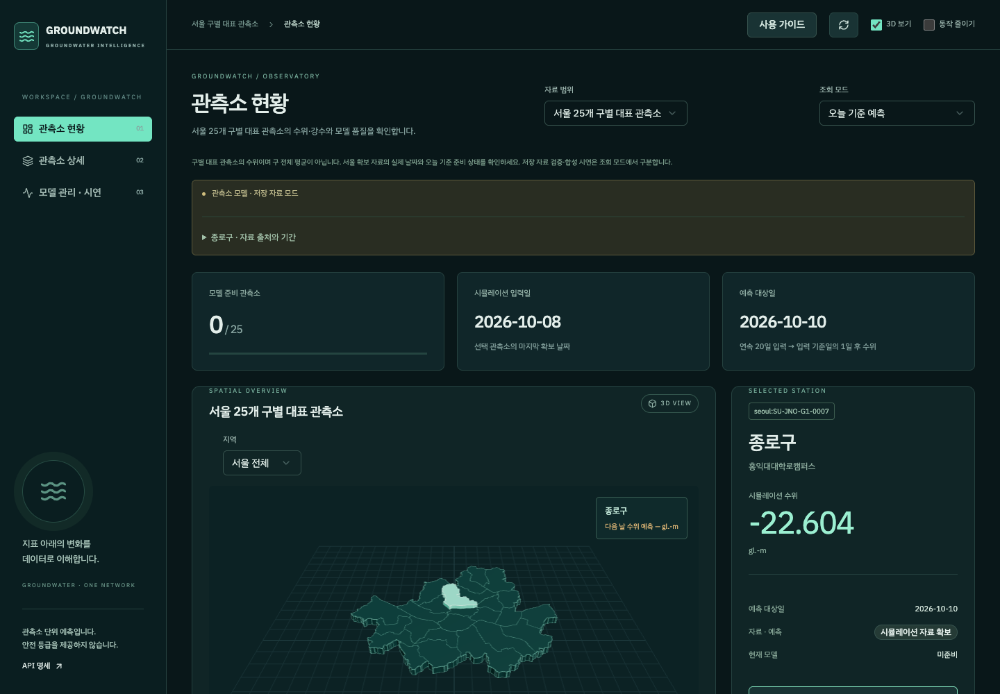
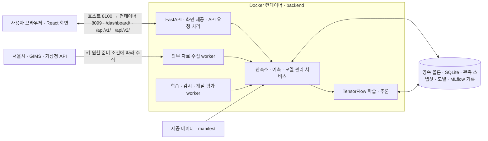

# GroundWatch

**지하수위 예측 모델의 서빙·모니터링·자동 재학습을 구현한 AIOps 프로젝트**

GroundWatch는 지하수 관측·시설 유지관리 담당자를 위한 예측 모니터링 서비스입니다. 담당자는 관측소별 수위와 예측 오차를 확인하고, 운영자는 성능이 떨어진 모델을 찾아 재학습할 수 있습니다. 새 모델은 기존 모델과 비교해 성능 기준을 통과한 경우에만 적용합니다.

SKALA 4기 광주3반 5조가 ‘모델 서빙 및 AIOps 구성’ 과목에서 진행한 팀 프로젝트입니다.

[제안서 PDF](deliverables/final/AIOps_조별%20과제_광주_3반_GroundWatch.pdf) · [편집용 PPTX](deliverables/source/AIOps_조별%20과제_광주_3반_GroundWatch.pptx) · [동작 코드 ZIP](deliverables/final/AIOps_조별%20과제_광주_3반_GroundWatch_동작코드.zip) · [실행 증거](evidence/README.md)



*2026-10-09 최신 UI 검증 화면입니다. 자료·모델 준비 상태를 구분해 표시합니다.*

## 프로젝트 소개

예측 모델은 배포 후에도 입력 누락·응답 지연·예측 오차 증가를 관리해야 합니다. GroundWatch는 최근 20일의 수위·강수를 이용하는 LSTM 예측에 **서빙 → 모델 버전 관리 → 모니터링 → 재학습·후보 평가**를 연결한 서비스입니다.

| 이해관계자 | 겪는 문제 | 제공하는 가치 |
| --- | --- | --- |
| 지하수 관측·시설 유지관리 담당자 | 관측소별 수위·예측 날짜·모델·오차를 따로 확인해야 함 | 지도와 상세 화면에서 관측·예측·모델 상태를 함께 조회 |
| 서비스·모델 운영자 | 품질 저하 확인과 새 모델 적용 여부 판단에 수작업 필요 | 응답·오차 감시, 품질 알림, 재학습·후보 평가와 교체·유지·복귀 이력 제공 |

## 주요 기능

| 기능 | 설명 |
| --- | --- |
| 서울 구별 관제 | 서울 25개 구의 고정 대표 관측소를 지도에서 선택하고 수위·강수·모델 상태 조회 |
| 수위 시각화 | Three.js 수위 비교·GL 개념 단면, 수위와 강수 이력 차트 |
| 전국 자료 확장 | 같은 관제에서 전국 실측 3곳과 별도 합성 17개 시·도 시나리오 선택 |
| 강수·장마 분석 | 실제 강수 지도·공식 장마 기간 표시·모델별 계절 오차 비교 |
| 모델 운영 | 학습 작업·모델 버전·드리프트 경보·후보 평가·기존 모델 유지·복귀 이력 조회 |
| 실제 API 조회 | 서울 API 수위 원본 값과 강수 결측 여부를 별도 모델로 처리. 키·자료 미준비 시 대기 상태 표시 |

## 과제 요구사항과 구현·검증

[팀 안내에 정리된 필수 6항목](docs/team-guide.md#과제-요구사항과-확인-위치)을 기준으로, 구현 내용과 확인 범위를 함께 표시합니다.

| 요구사항 | 구현·확인 내용 | 근거·한계 |
| --- | --- | --- |
| ① 이해관계자·Pain Point | 관측 담당자와 운영자의 조회·품질 관리 문제 정의 | 위 프로젝트 소개의 대상·문제·제공 가치 |
| ② AI 솔루션·운영 목표 | LSTM 다음 날 수위 예측, p95 응답 1초 이하·5xx 1% 미만 목표 | 과제 운영 목표이며 장기 SLA 달성을 검증한 수치는 아님 |
| ③ 게이트·임계값·자동 대응 | 오차 감시 → 알림 → 재학습 → 후보 평가 → 교체 또는 유지, 복귀 기능 | 합성 시연에서 교체·탈락 확인. 실제 미래 30일 운영 검증은 남음 |
| ④ 데이터부터 재학습까지 구성도 | 수집·검증·저장·학습·서빙·감시와 영속 저장 구조 | 아래 전체 구조도와 모델 운영 흐름 |
| ⑤ 실제 API와 오류 응답 | FastAPI 요청 검증·예측 조회·작업·상태 API, 오류·미준비 응답 | 실행 중 `/docs`, [API 명세서](docs/contracts.md), [HTTP 검증](evidence/records/2026-10-08-national/integration-final-http.json) |
| ⑥ 상태 변화가 드러나는 동작 증거 | 후보 생성·승격·탈락, 실제 버전 응답, 재기동 후 예측 보존 | [승격 시연](evidence/records/presentation-demo-http.json)·[탈락 시연](evidence/records/chart-feedback-http.json)·[최신 검증](evidence/records/2026-10-09-final/verification.json) |

### 모델 운영 흐름

서울 저장 자료·합성 시연의 기본 정책은 다음과 같습니다. 실제 API·전국 모델별 세부 조건은 [운영 기준](docs/operations.md)을 따릅니다.

1. 연속 20일 입력으로 다음 날 수위를 예측하고 모델 버전과 함께 저장합니다.
2. 실제 정답이 도착하면 연속 21일 RMSE를 평가합니다.
3. 초기 검증 rolling RMSE의 P95 × 1.5를 연속 2회 초과하고 21일 cooldown 및 입력 조건을 만족하면 후보를 학습합니다.
4. 후보 학습 이후 새 정답 30일에서 기존 모델과 비교합니다.
5. 후보 RMSE가 기존 모델보다 5% 이상 개선되고, 과거 검증 구간 RMSE가 초기 검증 RMSE의 110% 이하면 교체합니다. 기준 미달은 기존 모델 유지, 정답 부족은 평가 대기로 처리합니다.

저장된 합성 시연에서는 RMSE 9.27% 개선 후보의 교체와 2.51% 개선 후보의 탈락을 확인했습니다. 합성 다년 평가에서는 장마·강한 강수 오차가 악화되어 장마 정확도 개선을 성과로 주장하지 않습니다.

## 교수님 피드백 반영

| 교수님 피드백 | 반영 내용 | 결과와 남은 한계 |
| --- | --- | --- |
| 서울 외 지역도 가능한가 | 기존 관제에서 전국 실측 3곳과 별도 합성 17개 시·도 시나리오를 선택하도록 확장 | 전국 모든 관측소의 실측 예측 지원은 아님. 실측·합성 자료와 모델 이력 분리 |
| 장마 때 정확도를 확인할 수 있는가 | 공식 장마 기간과 강수 자료를 연결하고, 기존 M0·강수 특징을 추가한 M1의 장마·비장마·강한 강수 구간별 RMSE·MAE·표본 수 비교 | 실측 지역별 개선·악화가 다르고 합성 평가의 장마·강한 강수 오차는 악화. 장마 정확도 개선은 확인되지 않음 |
| 파인튜닝한 모델이 허용 기준은 통과했지만 기존 모델보다 성능이 나쁘면 어떻게 할 것인가 | 허용 기준 통과만으로 승격하지 않도록 이중 게이트 적용. 후보 학습 이후 동일한 새 정답 30일에서 기존 모델 대비 RMSE가 5% 이상 개선되고, 과거 검증 구간 RMSE도 초기 검증 RMSE의 110% 이하여야 승격. 기존 모델보다 나쁘거나 개선 폭이 부족하면 기존 모델 유지 | 합성 시연에서 9.27% 개선 후보의 실제 버전 교체와 2.51% 개선 후보의 탈락 확인. 성능 악화 사례를 직접 검증했다는 의미는 아님. 실제 미래 30일 운영 승격은 미검증이며 전국 실험·합성 모델의 운영 승격은 차단 |
| 법적 문제를 조사하고 고려했는가 | 서울 관측자료의 이용허락·출처표시 조건을 확인하고 데이터 문서에 출처 기록. 서비스 범위를 지하수위 예측·품질 감시로 한정하고 싱크홀 확률·현장 안전 판정으로 표현하지 않음 | 데이터 이용조건 확인과 서비스 범위 검토 수준. 전체 데이터·지도·소프트웨어의 이용조건, 실제 도입 시 안전 관련 법령·책임 범위의 종합 법률 검토는 미완료 |

세부 승격 조건은 [운영 기준](docs/operations.md), 평가·승격·탈락의 확인 근거는 [실행 증거](evidence/README.md)에 정리했습니다.

### 법적 검토 범위

서울 관측자료는 [서울 열린데이터광장의 공식 이용허락](https://data.seoul.go.kr/dataList/OA-15611/A/1/datasetView.do)에 공공누리 제1유형(출처표시, 상업적 이용·변경 가능)으로 명시되어 있음을 확인했습니다. 자료별 출처·단위·이용조건은 [데이터 설명](data/README.md)에 기록합니다. 이 확인이 모든 외부 API·지도·배포 자료의 이용 허락이나 서비스 전체의 법적 적합성을 보장하는 것은 아닙니다.

현재는 과제용 예측·검증 서비스이며 법정 안전진단이나 현장 안전 판단을 제공하지 않습니다. 실제 도입 전에는 사용 자료별 재배포·API 이용조건과 안전 관련 법령의 적용 여부, 예측 오류에 대한 책임·계약 범위를 추가 검토해야 합니다.

## 데이터 범위와 한계

서울 25개 구 대표 관측소, 전국 실측 3곳, 전국 합성 17개 시·도 시나리오를 구분해 제공합니다. 실측과 합성은 자료·모델·이력을 분리하며, 관측소별 예측은 구 전체 수위나 싱크홀 발생 확률을 뜻하지 않습니다.

실제 API 수집·예측에는 승인 키와 유효 자료가 필요합니다. 장마 정확도 개선과 실제 미래 30일 운영 평가는 아직 확인되지 않았으며, 수위 단면은 개념도입니다. [데이터 출처·단위](data/README.md)와 [운영 전 추가 확인](docs/operations.md#운영-전-추가-확인)을 참고하세요.

## 기술 스택

- **프론트엔드:** React · TypeScript · Three.js · Tailwind CSS · shadcn/ui
- **백엔드:** FastAPI · SQLite
- **AI·모델 관리:** TensorFlow · MLflow
- **실행 환경:** Docker
- **테스트:** pytest · Vitest · Playwright

## 전체 구조도

Compose의 `backend` 서비스 하나에서 FastAPI와 수집·학습·감시 worker를 실행합니다. React는 빌드된 정적 파일을 FastAPI가 제공하며 사용자 브라우저에서 실행됩니다.



모델 품질 감시는 발행 예측에 실제 정답이 도착한 뒤 오차를 평가하고, 조건 충족 시 재학습 후보를 생성합니다. 후보 평가·승격 조건을 통과하면 서빙 모델을 교체하며, 탈락하거나 정답이 부족하면 기존 모델을 유지합니다. 실측 자료와 합성 시연은 별도 자료·모델·이력으로 관리합니다. 서비스 응답 지표는 FastAPI에서 따로 수집합니다.

MLflow는 별도 서버 없이 로컬 SQLite와 artifact 파일을 사용합니다. 위 그림은 소스·Compose 기준의 실행 구조이며, 실제 수집·학습·승격의 확인 결과는 [실행 증거](evidence/README.md)를 따릅니다. 세부 조건은 [운영 기준](docs/operations.md)을 확인하세요.

## 실행 방법

Docker Desktop과 빌드용 인터넷 연결이 필요합니다. 저장소 루트에서 실행합니다.

```bash
docker compose up --build
```

- 관제 화면: http://localhost:8100/
- API 명세서: http://localhost:8100/docs
- 상태 확인: `/health/live`(프로세스), `/health/ready`(자료·모델 준비)

첫 실행에서는 자료 검증과 모델 학습이 자동 진행됩니다. 자료가 부족하거나 평가를 통과하지 못한 관측소는 대기 상태로 표시됩니다.

저장 자료·합성 시연은 외부 API 키 없이 사용할 수 있습니다. 실제 수집에는 `.env.example`을 참고해 로컬 `.env`에 승인된 키를 설정합니다. 포트는 `GROUNDWATCH_PORT`로 변경할 수 있으며 기본값은 8100입니다.

상태·로그 확인과 종료:

```bash
docker compose ps
docker compose logs --tail=100 backend
docker compose down
```

종료 후에도 모델·자료 볼륨은 유지됩니다. 오류별 대응은 [운영 안내](docs/operations.md#실행-문제-해결)를 확인하세요.

## 검증

저장된 2026-10-09 결과는 백엔드 **245개 통과·1개 건너뜀**, 프론트엔드 **단위 35개·통합 5개·E2E 4개 통과**, 호환 화면 테스트·프로덕션 빌드 통과입니다. 복사한 실행 볼륨에서 Docker 빌드·기동·재기동과 과거 모델의 동일 예측 응답을 확인했습니다. 이 검증에서는 외부 수집과 추가 학습을 비활성화했습니다. 생존 응답은 200, 현재 자료·모델 준비 응답은 503이므로 전체 실시간 예측 준비 완료로 표시하지 않습니다.

프론트엔드 전체 테스트와 빌드(Node.js 22·Chrome 필요):

```bash
npm --prefix frontend ci
npm --prefix frontend run test:all
npm --prefix frontend run build
```

백엔드 테스트(Compose 기동 후 실행):

```bash
docker compose exec backend python -m backend.worker_runtime --state-root /app/runtime/groundwatch --locked-command python -m pytest backend/tests -q
```

저장된 [2026-10-09 검증 결과](evidence/records/2026-10-09-final/verification.json)와 [실행 증거](evidence/README.md)에서 테스트·실제 HTTP·화면 확인을 구분합니다. 브라우저 E2E는 모의 API를 사용하며, 합성 승격 시연은 실제 미래 30일 운영 검증과 구분합니다. 세부 테스트 방법은 [프론트엔드](frontend/README.md#검증)·[백엔드](backend/README.md#검증)를 참고하세요.

## 디렉터리 구조

```text
GROUNDWATCH/
├── frontend/       # React 화면·프론트엔드 테스트
├── backend/        # API·모델·worker·백엔드 테스트
├── data/           # 제공 데이터·출처·manifest
├── scripts/        # 기동·수집·변환·검증 도구
├── docs/           # 팀 안내·API 명세서·운영 기준
├── evidence/       # 검증 결과·HTTP 응답·화면 캡처
├── deliverables/   # 제출 PDF·ZIP·편집 PPTX
└── compose.yaml    # 공용 실행 설정
```

## 팀원

**SKALA 4기 광주3반 5조 · 팀원 및 담당 역할**

| 조건우 | 박건우 | 이병주 | 최은주 | 장서연 | 한형준 |
| :---: | :---: | :---: | :---: | :---: | :---: |
|  |  |  |  |  |  |
| PM·기획<br>일정 관리 | 프론트엔드<br>백엔드 | 프론트엔드<br>백엔드 | AI 모델<br>AIOps | AI 모델<br>AIOps | 데이터 분석<br>전처리·발표 |

## 문서와 제출 자료

| 자료 | 위치 |
| --- | --- |
| 제출용 제안서·동작 코드 | `deliverables/final/`의 PDF·ZIP |
| 제안서 편집 원문·팀원 이미지 | `deliverables/source/`의 PPTX·assets |
| 사용법·전체 로직·교수자 원본과의 차이 | [팀 안내](docs/team-guide.md) |
| API·날짜·누락값 형식 | [API 명세서](docs/contracts.md) |
| 감지·교체·복귀·운영 전 추가 확인 | [운영 기준](docs/operations.md) |
| 출처·단위·자료 확보 범위 | [데이터 설명](data/README.md) |
| 실제 실행 결과·과거 기록 | [실행 증거](evidence/README.md) |
| 브랜치·커밋·팀 협업 규칙 | [AGENTS.md](AGENTS.md) |
| 파트별 개발·컨벤션·검증 | [프론트엔드](frontend/README.md) · [백엔드](backend/README.md) |

제안서는 PPTX로 편집하고 PDF로 제출합니다. 교수자 제공 코드의 출처와 GroundWatch에서 변경한 내용은 [팀 안내](docs/team-guide.md)에 정리했습니다.

상세 운영 정책과 API 형식은 위 문서에서 관리합니다.
