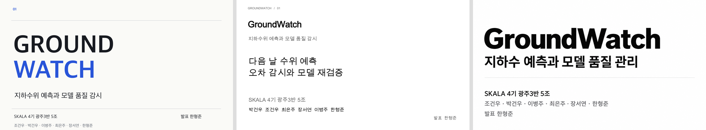

# GroundWatch 5조 발표자료 — 디자인 재설계

SKALA 4기 광주3반 5조: 박건우, 조건우, 최은주, 장서연, 이병주, 한형준. 발표자는 한형준입니다.

교수자 지정 파일명은 `AIOps_조별 과제_광주_3반_GroundWatch`입니다. 기획서의 필수 6항목과 실제 자료·시뮬레이션·합성 검증의 구분을 유지하면서 세 가지 디자인을 각각 다시 제작했습니다. 각 자료 맨 마지막에는 전체 조원의 역할·이름과 사진 자리를 배치했습니다. 사진은 사용자 요청에 따라 자리만 마련했습니다.

| 버전 | 디자인 | 구성과 편집 |
| --- | --- | --- |
| OpenAI | 화이트·검정·코발트, 비대칭 편집형 | 26장: 본문 18·부록 7·팀원 1. 텍스트·도형·차트 편집 가능 |
| Anthropic | 화이트·블랙, 기술 발표형 | 25장: 본문 18·부록 6·팀원 1. 텍스트·도형·차트 편집 가능 |
| codex-ppt | 화이트·블랙, 타이포그래피 중심 | 14장 이미지형. 문구 수정은 재생성 필요 |

편집형 2종은 원본 실행 화면의 핵심 영역을 전용 페이지에서 크게 보여줍니다. 전체 원본 스냅샷은 공통 기획서에 보존했습니다. 이미지형은 화면·로그를 생성 이미지로 모방하지 않으며, 동작 순서를 개념도로 설명합니다. 이미지형을 사용할 때는 실제 증빙이 담긴 공통 기획서를 함께 확인합니다.

## 디자인 미리보기

왼쪽부터 OpenAI, Anthropic, codex-ppt입니다.

## 파일

- [OpenAI PPTX](openai-slides/AIOps_조별 과제_광주_3반_GroundWatch.pptx) · [PDF](openai-slides/AIOps_조별 과제_광주_3반_GroundWatch.pdf)
- [Anthropic PPTX](anthropic-pptx/AIOps_조별 과제_광주_3반_GroundWatch.pptx) · [PDF](anthropic-pptx/AIOps_조별 과제_광주_3반_GroundWatch.pdf)
- [codex-ppt PPTX](codex-ppt/AIOps_조별 과제_광주_3반_GroundWatch.pptx) · [PDF](codex-ppt/AIOps_조별 과제_광주_3반_GroundWatch.pdf)
- [기획서 DOCX](proposal/AIOps_조별 과제_광주_3반_GroundWatch.docx) · [PDF](proposal/AIOps_조별 과제_광주_3반_GroundWatch.pdf)
- [전체 자료 ZIP](../AIOps_조별 과제_광주_3반_GroundWatch.zip)

각 스킬 폴더에는 발표대본과 디자인_프롬프트.md, 동일한 기획서 DOCX/PDF가 있습니다. 디자인 참고 자료와 비교는 [디자인_비교.md](디자인_비교.md)에 정리했습니다. 서체가 없는 다른 컴퓨터에서 PPTX를 열면 대체될 수 있어 고정 배치 PDF도 함께 제공합니다.

## 참고와 범위

실제 제작은 OpenAI 공식 Presentations(artifact-tool), Anthropic 공식 pptx(PptxGenJS), ningzimu codex-ppt(내장 이미지 생성·조립) 세 방식입니다. [사용자 지정 스킬](https://github.com/ningzimu/codex-ppt-skill/blob/main/README_ko.md)과 [비교 글](https://2slides.com/ko/blog/best-ppt-skills-claude-code-codex-2026)을 조사했습니다. 2Slides는 전용 키와 크레딧이 없어 호출하지 않았습니다. Canva·Gamma·Beautiful.ai는 디자인·프롬프트 원칙을 참고했으며 해당 서비스로 생성하지 않았습니다.

통합가이드 7·17~19쪽과 강의 129~132·135~139쪽, team/proposal.md, docs/team-logic-guide.md, evidence/README.md를 대조했습니다. 발표는 20분 이내이며 부록은 질문 대응용입니다. 공공기관 직접 도입(B2G)과 과제 B2B 조건 적합성, 최종 제출·발표 결과는 별도 확인 사항입니다. 인증키는 포함하지 않습니다. 역할 배정과 개인별 직접 구현 성과는 구분합니다.

2026-10-08 반영: 기존 실측 52,591행에 합성 23,350행을 별도 확장하고 25개 별도 모델을 실제 학습했습니다. 기본 화면은 오늘 입력→내일 예측이며 합성 출처를 표시합니다. 실측·합성 RMSE와 측정 조건을 구분하고 RMSE 선택 및 WAPE 직접 적용 제외 이유를 기록했습니다. 기본 자료 읽기·합성 확장·학습은 기동 시 자동 수행하며, CSV 등록·초기 학습은 운영 화면의 접힌 수동 자료 관리에 보존합니다.

최종 문구 대조: 현재 메뉴는 ‘오늘 기준 예측’·‘과거 관측 검증’이며 출처는 ‘시연 데이터 · 합성 자료 포함’으로 간소화했습니다. 기존 실행 스냅샷은 간소화 이전 원본이므로 실제 값과 상태를 그대로 보존합니다. 이전 PDF는 ../pdf/archive/에 보관하며 현재 제출본과 구분합니다.
