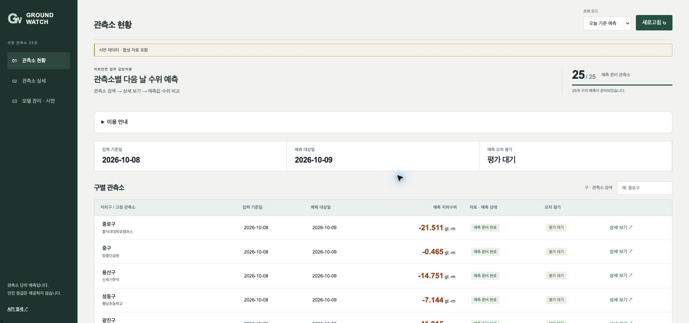
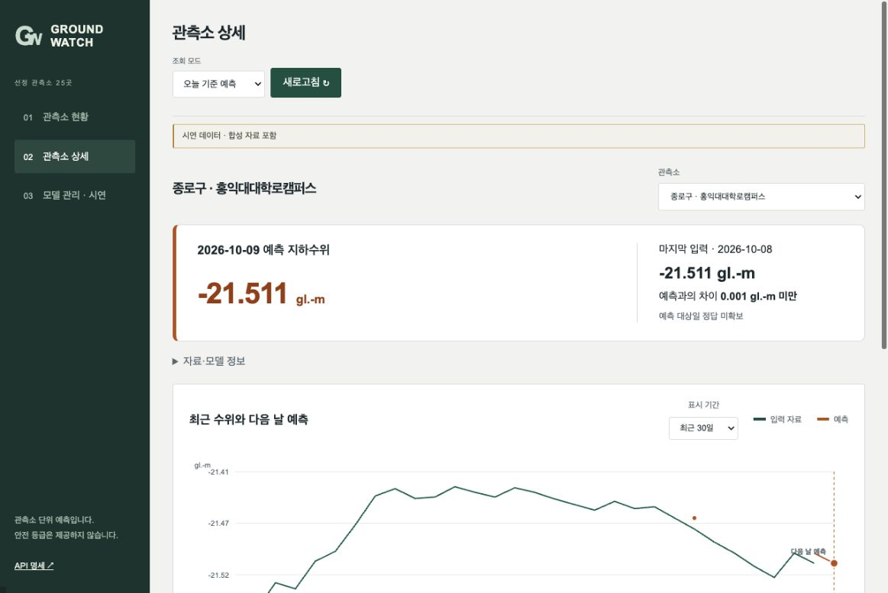
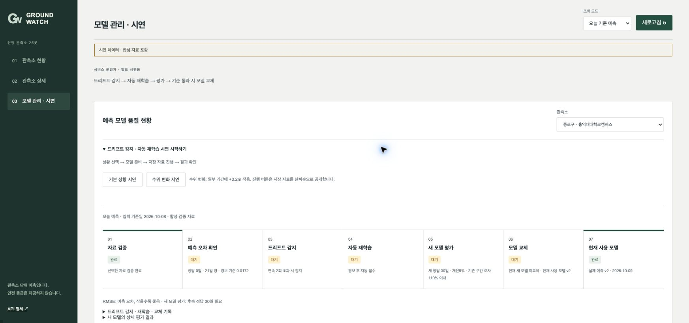
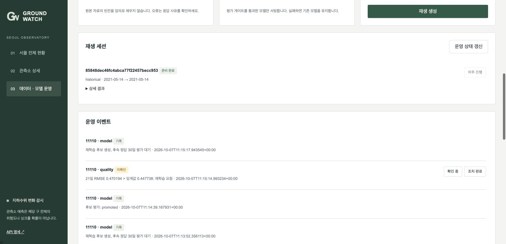
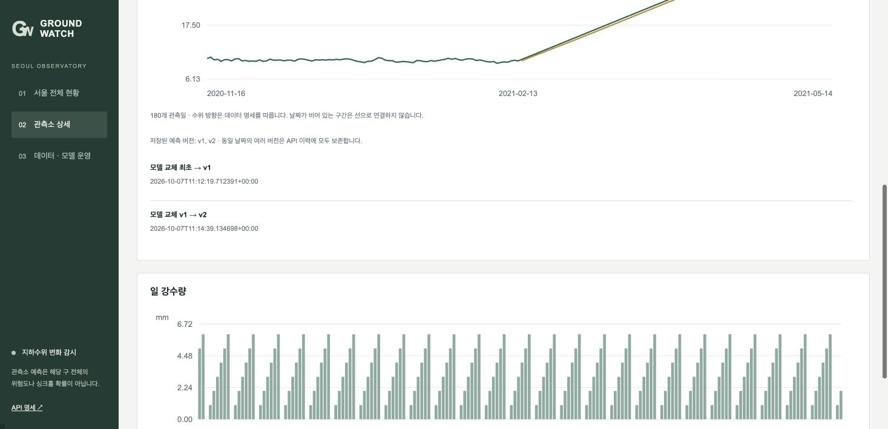
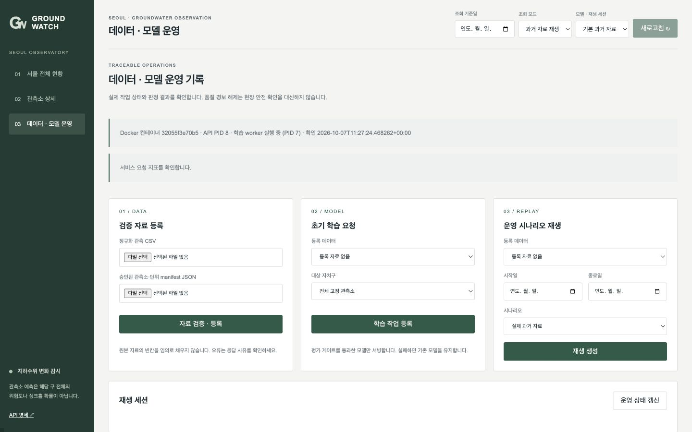

# GroundWatch 팀 기획서
서울 지하수위 예측과 모델 품질 감시 시제품

SKALA 4기 광주 3반 5조
박건우 · 조건우 · 최은주 · 장서연 · 이병주 · 한형준
발표자 한형준  |  작성 기준 2026년 10월 8일

우리 팀은 서울의 공식 과거 관측자료를 이용해 관측소별 다음 날 지하수위를 예측하고, 예측 오차가 커질 때 재학습과 후보 평가를 수행하는 서비스를 구성했습니다. 최신 실측이 없는 2024년 3월 19일부터 2026년 10월 8일까지는 별도 합성 구간으로 확장했습니다. 기존 원본은 보존하고 합성 확장 자료를 별도 모델로 학습해 오늘 기준 다음 날을 예측합니다. 합성 구간의 예측은 실제 최신 서울 관측에 대한 예측이나 현장 성능을 의미하지 않습니다.

## 1 이해관계자와 해결할 문제
주 사용자는 공공기관의 지하수·지하안전 업무 담당자입니다. 담당자는 여러 관측소의 변화와 자료 상태를 확인하고 검토할 대상을 정합니다. 관측자료와 모델 이력이 흩어져 있으면 변화 확인이 늦어지고, 모델 오차가 커졌는데도 기존 예측을 계속 참고할 수 있습니다.

서비스 장애는 조회 업무를 중단시키고, 응답 지연은 관측소 비교를 어렵게 합니다. 자료 공급 지연과 모델 품질 저하는 예측값을 업무 판단에 참고할 수 있는지를 불분명하게 만듭니다. 따라서 예측값과 함께 기준일·단위·버전·준비 상태 및 품질 이벤트를 제공합니다.

직접 구매자를 공공기관으로 보면 B2G입니다. 과제의 B2B 관점에 맞는 민간 환경안전 용역사 공급 경로도 검토할 수 있으나, 구매 의사와 효과를 확인한 고객은 아닙니다. 기존 팀의 B2B 조건과 공공기관 지향 기획의 적합성은 교수자 확인이 필요합니다.

이 서비스는 지하수위 변화 검토를 돕는 과제 시제품입니다. 관측소 하나가 구 전체나 특정 공사 현장을 대표하지 않으며, 싱크홀 발생 확률이나 재난 예방 효과를 검증한 서비스로 소개하지 않습니다.

## 2 AI 해결책과 운영 목표

### 예측이 하는 일
25개 구마다 관측소 하나를 고정하고, 최근 연속 20일의 수위와 일 강수량으로 다음 날 수위를 예측합니다. 마지막 관측 수위에 LSTM이 학습한 변화량을 더하는 구조를 사용합니다. 단순히 마지막 수위를 다음 날 값으로 사용하는 persistence 기준과 비교합니다. 미래 강수는 입력하지 않습니다.

### 어떤 데이터를 어떻게 연결했는가
서울시 공개 관측 HTML에서 날짜 배열 categories1, 수위 seriesData1, 강수 seriesData4를 같은 인덱스로 묶었습니다. 요청한 관측소 ID와 구 코드를 붙이고 station_id와 date로 중복·충돌을 확인했습니다. 관측소와 구, 단위의 연결은 고정 manifest로 관리합니다. 현재 학습자료는 기상청 ASOS를 결합한 자료가 아닙니다.

| 항목 | 현재 적용 |
| --- | --- |
| 규모와 기간 | 25개 관측소 · 52,591행
2018-01-01~2024-03-18 |
| 원천 단위 | 수위 gl.-m · 일 강수량 mm |
| 입력과 정답 | 연속 20일 × [수위, 강수] → 다음 날 수위 |
| 시간 분리 | 학습 최대 730개 유효 표본 → 검증 60일 → 테스트 60일 → 공통 재생 90일 |
| 누수 방지 | scaler는 학습 자료에만 적합 · 날짜 공백을 잇지 않음 · 공개 전 정답 미사용 |
| 과제용 합성 확장 | 2024-03-19~2026-10-08 · 합성 23,350행 추가 · 전체 75,941행 · 별도 모델 |

합성 생성은 관측소별 과거 동월 강수를 재표본화하고, 마지막 실측 수위에서 동월 중앙값 방향으로 완만하게 이어가는 과제용 시나리오입니다. 고정 seed 20261008을 사용합니다. 원본 52,591행의 날짜·값은 유지하고 origin 열과 manifest에 합성 구간·생성식·원본 해시를 남깁니다. 최근 학습·평가 구간 대부분이 합성이므로 별도 namespace에 저장하며 기존 실측 평가와 합치지 않습니다.

유효하지 않은 날짜·단위·유한값·강수 부호를 거절하고 같은 관측소·날짜의 충돌은 격리합니다. 결측 강수를 0으로 채우거나 수위의 부호를 임의로 바꾸지 않습니다. 다음 날 예측값이 존재해도 정답 공개 전의 관측값과 강수는 null로 둡니다.

## 2 평가 지표와 운영 목표

### 지표를 선택한 이유
RMSE = √평균((예측−정답)²)이며 수위와 같은 gl.-m 단위입니다. 큰 오차에 민감하고 낮을수록 좋습니다. 동일한 시간 분할에서 persistence와 비교하고 관측소별 RMSE의 단순 평균(macro)을 보고합니다. 가이드 38쪽은 RMSE를 기본으로 유지하며 판매량 같은 업무에 WAPE 보완을 권장합니다. 우리 수위는 음수·기준면 이동이 가능해 실제값 합을 분모로 하는 WAPE를 주 지표로 그대로 적용하지 않았습니다.

확장 자료의 첫 전체 25개 학습 결과는 macro RMSE 검증 0.016396, 테스트 0.020471 gl.-m이며 같은 구간 persistence는 0.016561, 0.020544입니다. 이는 대부분 합성 구간에 대한 내부 평가이고, 매끈한 생성식의 영향을 받습니다. 기존 실측 모델의 검증 0.265764·테스트 0.182625와 데이터가 달라 정확도 개선으로 비교하지 않습니다. 이후 CSV 수동 재학습으로 종로 합성 모델은 v2, 나머지 24개는 v1입니다.

### 목표와 확인 결과를 구분합니다
준비된 전체 조회의 p95 1초 이하, 통제된 정상 요청의 5xx 1% 미만, 잘못된 입력 422와 재시작 후 버전·이력 보존을 목표로 삼았습니다. 로컬 단일 클라이언트의 순차 100회에서 200 응답 100회, 5xx 0회, warm p95 0.0404초를 확인했습니다. 최초 cold 요청은 3.849초였습니다. 동시 부하 성능이나 클라우드 가용성 SLA를 검증한 결과는 아닙니다.

별도 실제 운영창의 /metrics/summary 응답은 최근 300초 107건에서 평균 0.153145초, p95 0.653799초, 오류율 0을 반환했습니다. 브라우저·검증 요청이 섞인 운영창이며 앞의 통제된 warm 100회 실험과 같은 조건이 아닙니다. 평균(mean_seconds)과 p95를 함께 제공하고, 기존 p95 기반 경보 정책은 유지합니다.

## 3 운영 설계와 대응 정책
| 단계 | 판단 조건과 조치 |
| --- | --- |
| 초기 배포 게이트 | 입력 스키마 검증 후 검증 RMSE ≤ persistence RMSE × 1.10일 때 등록·서빙 |
| 오차 감시 | 최근 21일 RMSE > 검증 rolling RMSE P95 × 1.5가 연속 2회이면 품질 이벤트와 재학습 작업 등록 |
| 반복 실행 제한 | 관측소별 cooldown 21일 적용 |
| 후보 학습 | 최근 연속 41일로 fine-tuning 후 새 정답 30일 동안 기존 모델과 shadow 비교 |
| 교체 게이트 | 후보 RMSE 5% 이상 개선 + 과거 검증 오차 증가 10% 이내 + 모델 로딩 검사 |
| 실패 대응 | 후보 거절·정답 대기는 기존 모델 유지. 검증된 이전 버전으로 화면 사유 입력 없이 복귀하고 서버에 기본 요청 사유 기록 |

21일 창은 하루 변동을 완화하고, 연속 두 번의 초과와 cooldown은 반복 경보·학습을 줄이려는 설정입니다. 초기 110%는 단순 기준보다 크게 나쁜 모델의 유입을 막는 허용치이며 우수한 예측을 보장하지 않습니다. 후보 5% 개선과 과거 guard는 작은 변동만으로 교체하거나 이전 구간의 품질을 크게 잃는 것을 막습니다. 이 값은 과제 운영 가설이며 현장 안전 기준이 아닙니다.

데이터 드리프트는 입력 분포가 변하는 현상이고 컨셉 드리프트는 입력과 정답의 관계가 변하는 현상입니다. 현재 시스템은 RMSE 오차 경보를 관찰하며, 경보 원인이 어느 드리프트인지 통계적으로 구분 확정하지 않습니다.

### 누가 무엇을 확인하는가
운영 담당자는 화면과 영속 이벤트 로그에서 품질 경보·재학습·후보 평가 상태를 확인합니다. 자동 작업이 끝나도 현장 확인 완료로 처리하지 않습니다. 이벤트 확인과 해제에는 별도의 사유를 남기며, 팀 역할은 마지막 쪽에 명시하되, 역할을 개인별 세부 구현 성과로 확대하지 않습니다.

서비스 지표는 최근 300초의 p95·5xx 비율·처리량을 60초마다 평가하며 최소 20건 전에는 판단을 보류합니다. p95가 1초를 넘거나 5xx가 1% 이상이면 자료 신선도, worker 상태, 모델 로딩과 요청 로그를 확인합니다. 예측 오차 경보와 서비스 장애 경보는 별개로 다룹니다.

### 재학습은 교체 성공과 다릅니다
실제 서울 과거자료의 90일 재생에서는 후보가 거절되거나 새 정답 부족으로 대기했습니다. 별도 합성 AR(1) 500일 실험에서만 자동 승격까지 확인했습니다. 첫 합성 시나리오는 개선 3.56%로 거절됐고, 다음 시나리오는 5.81% 개선으로 v1에서 v2로 교체됐습니다. 합성 결과를 서울 실측 정확도 개선으로 해석하지 않습니다.

## 4 아키텍처와 데이터 흐름
기동 시 준비한 공식 과거 CSV와 manifest를 품질 검증한 뒤 시간순 학습·검증·테스트로 분리합니다. 학습 결과와 게이트를 통과한 모델을 MLflow에 기록하고, FastAPI는 실제 champion 모델의 예측값과 버전을 응답합니다.

공식 과거 CSV · manifest 준비 및 검증

↓ 품질 검증과 시간 분리

LSTM 학습 → 초기 게이트 → MLflow 모델 등록

↓ champion 모델 로딩

브라우저 ↔ FastAPI 서빙 ↔ 예측값과 실제 버전 기록

↓ 하루 관측 정답 공개

21일 오차 감시 → 품질 이벤트 → 영속 재학습 작업

↓ 별도 worker 프로세스

후보 학습 → 이후 30일 평가 → 교체 또는 기존 유지

### 저장과 실행의 책임
단일 Docker 서비스 안에서 API와 학습 worker를 별도 프로세스로 실행합니다. SQLite는 자료 검증·작업·예측·이벤트·교체 이력을 보존하고, MLflow는 실험과 모델 버전을 관리합니다. CSV·SQLite·MLflow·모델은 지속 볼륨에 저장합니다. 프로세스가 재시작되면 모델과 완료 작업이 남는지 확인합니다.

실제 관측 재생, 모의 변화와 합성 검증은 namespace로 격리합니다. 오늘 기준 합성 확장은 synthetic namespace에 별도 모델을 저장합니다. 기존 공급 시뮬레이션은 별도 UUID 세션을 쓰는 내부 과거 재생 도구로 보존합니다.

### 교수자 HAIC 코드에서 바뀐 부분
제공 HAIC의 20일 가격·거래량 → 다음 날 가격 흐름을 20일 수위·강수 → 다음 날 수위로 치환했습니다. 고정 달러 RMSE 기준은 persistence 대비 게이트와 관측소별 오차 기준으로 바꿨습니다. 재학습을 영속 worker 작업으로 분리하고, 후속 정답 평가·후보 거절·alias 및 캐시 갱신·재시작 보존을 연결했습니다. 제공 원본은 individual/practice/project에 보존하며 팀원의 직접 작성 범위를 임의로 주장하지 않습니다.

## 5 실제 API와 요청 응답
외부 공급자 API와 아래 내부 모델 서빙 API는 구분합니다. 현재 기본 시연은 실측에 합성 구간을 추가한 CSV로 별도 모델을 학습하여 내부 API를 실행합니다. 전체 API 문서는 http://localhost:8100/docs 에서 확인합니다.

| Method와 URL | 요청 → 응답 |
| --- | --- |
| GET /api/v1/forecasts | mode=current → 200, as_of 2026-10-08 · ready_count 25 · forecast_date 2026-10-09 · synthetic |
| POST /api/v1/districts/{code}/predict | 연속 20일 sequence → 200, prediction·model_version·forecast_date |
| GET /health/live · /health/ready | 본문 없음 → 200; 모델 준비 부족은 ready 503 |
| POST /api/v1/datasets | multipart CSV file + manifest → 202, dataset_id·job_id |
| POST /api/v1/jobs/train | dataset_id, 선택 district_code → 202 작업 |
| POST /api/v1/replays | dataset_id·시작/종료일·scenario → 202, id·job_id |
| POST /api/v1/replays/{id}/advance | {"days":1} → 202, 영속 작업 ID |
| GET /api/v1/jobs/{id} | 본문 없음 → 200, 작업 status |
| GET /api/v1/events | 선택 replay_id → 200, 감지·재학습·교체 이력 |
| GET /api/v1/metrics/summary | 선택 seconds=300 → 200, mean_seconds·p95·5xx·요청수 |
| POST /api/v1/models/{code}/rollback | 선택 version·서버 기본 reason → 202, 복귀 작업 |

## 5 실제 요청·응답과 오류

### 당시 저장한 실측 단일 예측 응답
종로구 11110에 SU-JNO-G1-0007의 2024-02-28~03-18 연속 20일 sequence를 전달한 결과입니다. 각 원소는 station_id, date, groundwater_level, rainfall_mm, level_unit 필드를 갖습니다.

{"district_code":"11110", "prediction":-23.268960940539838, "model_version":"2", "unit":"gl.-m", "observed_date":"2024-03-18", "forecast_date":"2024-03-19", "namespace":"historical"}

교수자 /predict/batch-test의 배치 예측·오차 평가 역할은 팀 도메인의 /replays 생성과 /advance 날짜순 진행으로 치환했습니다. 연속 입력으로 예측을 저장한 뒤 다음 정답을 공개하고 최근 21일 RMSE를 계산합니다. 결과는 /jobs/{id}와 /events로 확인하며 HAIC 원본은 보존합니다.

### 오늘 기준 합성 예측과 CSV 등록
GET /api/v1/forecasts?mode=current 실제 응답에서 as_of=2026-10-08, ready_count=25와 각 행 forecast_date=2026-10-09, source_kind=synthetic를 확인했습니다. 내일 관측 수위와 강수는 null입니다. CSV와 manifest 재등록은 202 접수 후 ready, 종로 초기 학습은 202 접수 후 completed가 되었으며 합성 모델만 v2로 변경됐습니다. 이는 수동 초기 학습 검증이며 별도 AR(1) 자동 후보 승격 실험과 다릅니다.

### 오류와 비동기 접수
19일 입력·날짜 공백·음수 강수·잘못된 날짜는 422, 없는 작업은 404, 중복 진행은 409, 모델 미준비는 503입니다. 잘못된 as_of=invalid는 detail 안에 loc=["query","as_of"], input="invalid"와 날짜 해석 오류를 반환했습니다. 작업의 202는 완료가 아니므로 job_id를 다시 조회합니다. 공급 시뮬레이션은 하루만 공급할 수 있고 미래 기준일 조회와 다일 공급은 422로 거절합니다.

## 6 동작 화면과 시연
사용 순서  1 관측소 검색 → 2 상세에서 다음 날 예상 수위·변화 확인 → 3 운영자가 모델 관리·시연에서 오차와 학습 상태 확인

상세 상단에 예측 날짜·수위·마지막 입력값 대비 차이를 표시합니다. 수위·강수 그래프는 최근 30일을 기본으로 90일·180일을 선택하고 다음 날 예측점을 구분합니다. 같은 날짜의 입력값과 저장된 예측을 소수 셋째 자리로 비교해 높으면 빨강, 낮으면 파랑으로 입력 숫자와 해당 관측점만 표시하며, 같거나 비교값이 없으면 기본색이고 내일 예측의 색은 유지합니다. 자료·모델 정보는 접어서 보여줍니다. 합성 자료 표시는 유지하며 현장 위험 확률이나 안전 판정으로 해석하지 않습니다.

CSV 등록과 초기 학습은 관리자용 자료 등록과 학습에 두며 기본 사용에는 필요하지 않습니다. 기존 등록·학습 HTTP는 확인했으나 이번 CSV 업로드의 브라우저 검증은 확장 권한 오류로 미완료입니다. 이전 공급 시연 UI는 제거하고 API·기록·원본 증거를 보존합니다.

## 6 동작 화면과 상태 변화

시연은 기존 자료 또는 수위 +0.2m 가상 상황으로 시작합니다. 모델 준비와 하루·21일 자료 진행 중 완료 수와 상태를 자동 갱신하고 중복 요청을 막습니다. 21일 진행만으로 후속 정답 30일 평가가 끝나지는 않습니다. 오늘 예측으로 돌아가기로 기본 조회에 복귀합니다. 이전 모델 복귀에는 화면 사유 입력이 필요하지 않습니다.

합성 자동 검증에서 후보 shadow RMSE는 0.475578, 기존 모델은 0.504919로 약 5.81% 개선했습니다. 과거 guard 0.239334는 초기 검증 0.239003의 110% 이내였고 게이트와 학습률을 낮추지 않았습니다. 이 수치는 서울 실측 성능 향상이나 현장 일반화 증거가 아닙니다.

## 6 버전 전환과 실행 재현

실행 명령은 저장소 루트의 docker compose up --build 이며 브라우저는 http://localhost:8100/ 입니다. 시연은 오늘 기준 예측 → 관측소 상세 → 모델 품질·버전·작업 확인 순으로 진행합니다. 오차 감시와 교체는 보존한 과거 재생 증거로 설명합니다. 재학습과 30일 평가는 즉시 완료되는 과정이 아니므로 저장된 합성 성공·거절 증거를 함께 보여 줍니다. 발표는 한형준이 20분 이내로 진행합니다.

새 볼륨에서 25개 초기 학습과 실제 예측 준비, 재생 후 컨테이너 재생성 시 이력 보존, 중구의 검증된 v2→v1 롤백 및 v2 복원을 확인했습니다. 외부 최신 관측 확보, 클라우드 배포와 현장 효용은 완료 범위에 포함하지 않습니다.

근거: 통합가이드 7·17~19쪽, 강의 129~132·135~139쪽. 코드와 자세한 데이터 연결은 docs/team-logic-guide.md, API 계약은 docs/contracts.md, 실제 요청·측정·재시작·롤백 원문은 evidence/README.md 및 연결 JSON에 보존했습니다. API 키와 비공개 설정은 본 문서에 포함하지 않았습니다.

## 팀원 및 역할
SKALA 4기 광주 3반 5조  |  GroundWatch

팀에서 확정한 역할을 정리했습니다. 사진은 추후 추가할 수 있도록 자리를 마련했습니다.

| 팀원 | 역할 | 사진 |
| --- | --- | --- |
| 조건우 | PM | 사진 추가 예정 |
| 박건우 | 프론트엔드·백엔드 개발 | 사진 추가 예정 |
| 이병주 | 프론트엔드·백엔드 개발 | 사진 추가 예정 |
| 최은주 | AI 모델·AIOps | 사진 추가 예정 |
| 장서연 | AI 모델·AIOps | 사진 추가 예정 |
| 한형준 | 데이터 분석·전처리 및 발표 | 사진 추가 예정 |