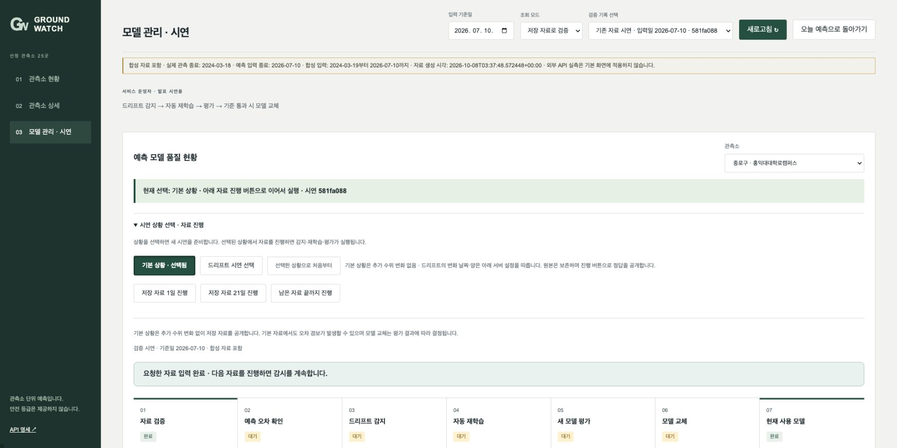
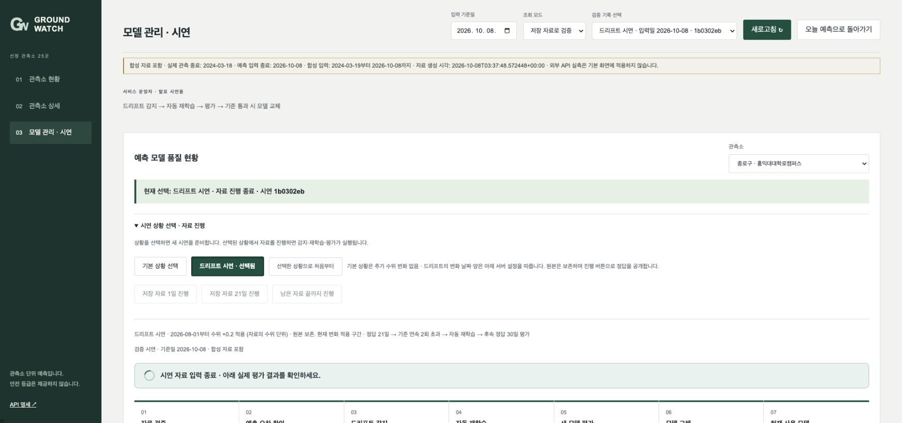
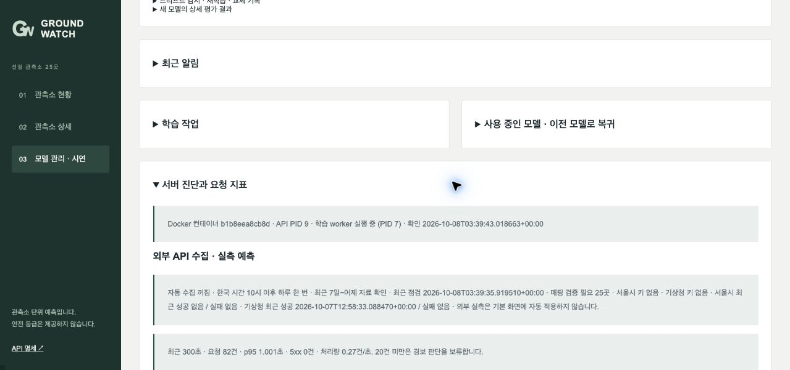

# GroundWatch 팀 기획 및 구현

SKALA 4기 광주3반 5조 · 발표 한형준. 현재 코드와 저장된 MVP 검증을 기준으로 정리했습니다. 발표용 PDF는 [별도 관리 파일](output/source/건우짱.pdf)에 있습니다. 이번 코드 기준 문서 갱신에서 발표자료는 편집·검수하지 않았습니다.

## 1. 이해관계자와 Pain Point

지하수 업무 담당자는 관측소별 자료 날짜·다음 날 예측·최근 변화를 확인해야 합니다. 서비스 운영자는 입력 부족·모델 미준비·예측 오차 증가를 구분하고 재학습 뒤 실제 새 모델 사용 여부를 확인해야 합니다. GroundWatch는 이 정보를 한 흐름으로 제공하는 과제용 시제품입니다.

구 전체 안전도·싱크홀 발생 확률·현장 조치 우선순위는 제공하지 않습니다. 공공기관 직접 판매는 B2G이며 과제 B2B 조건 인정 여부는 확인이 필요합니다. 교수자의 합성 시연 허용은 사용자 전달로 확인했습니다.

## 2. AI 해결책과 운영 목표

기본 화면은 서울시 VTsSec 지하수·기상청 ASOS 서울 108 강수를 날짜별 결합하여 최신 가용 관측 다음 날 수위를 예측합니다. 연속 20일 수위·강수·강수 결측 표시 3개 특성의 residual LSTM이며 구별 모델·scaler를 독립 관리합니다. 강수 빈값은 원본에 보존하고 모델 입력에서만 학습 구간 중앙값으로 대체합니다. 수위의 물리적 기준은 미확정이므로 `API 원값`을 유지합니다. 공식 과거 CSV·합성 확장은 별도 시연 모델입니다. 원천은 [데이터 설명](data/README.md)을 따릅니다.

모델 평가는 RMSE·MAE·persistence 비교를 사용합니다. RMSE는 모델이 사용하는 수위 값과 같은 단위로 오차를 비교하며 실제 API 모델은 API 원값 단위입니다. 음수·0이 있는 수위에 WAPE를 직접 적용하지 않습니다. 서비스 목표는 warm p95 1초 이하·HTTP 5xx 비율 1% 미만이며, 목표를 측정 결과처럼 쓰지 않습니다. 실측과 합성의 지표는 [검증 원문](evidence/README.md)에서 구분합니다.

## 3. 운영 설계

입력 검증 → 초기 학습 게이트 → 예측 저장 → 이후 API 정답 수신 → 오차 감시 → 재학습 후보 → 후속 평가 → 조건부 교체 순서입니다. 정답이 없으면 평가하지 않으며 실패·부족 상태는 기존 모델 유지 또는 미준비로 표시합니다. 과거 시험 예측은 운영 감시에 넣지 않고 발행 당시 없었던 정답만 이후 수집에서 평가합니다.

실제 API 정책은 연속 21일 RMSE가 초기 검증 RMSE의 1.5배를 연속 2회 초과하면 최근 41일로 후보를 학습하고, 이후 연속 30일 정답을 평가하는 구조입니다. 후보가 기존보다 5% 이상 개선되고 미학습 과거 guard에서 같은 기존 모델 오차의 110% 이내여야 교체합니다. 실제 API·시연의 서로 다른 임계값·학습 설정과 cooldown·복귀·장애 대응은 [운영 기준](docs/operations.md)을 따릅니다. 이는 모델 품질 정책이며 지반 안전 기준이 아닙니다.

기본 상황은 추가 수위 변화 없음, 드리프트 시연은 별도 세션의 22일째부터 +0.2 변화입니다. 예측·감지·재학습·평가는 실제 실행하며 교체 결과를 미리 만들지 않습니다. 외부 알림 발송·현장 위험 판단은 구현 범위가 아닙니다.

## 4. 아키텍처와 데이터 흐름

```text
서울시 VTsSec 수위 + 기상청 ASOS 서울 108 강수
→ 날짜별 결합·원본/스냅샷 보존·연속 수위 입력 검증
→ 구별 시간 분할·train-only 중앙값/scaler·별도 masked residual LSTM
→ MLflow 모델 + SQLite 작업·예측·이벤트
→ FastAPI → React·TypeScript 현황·상세·운영 화면
→ 영속 worker의 재학습·후보 평가·교체/유지
```

단일 Docker Compose 안에서 API·학습 worker·외부 수집 worker를 실행하고 자료·모델·이력을 볼륨에 보존합니다. 자동 API 수집은 KST 10시 이후 하루 1회 배치이며 오류 시 1시간 후 재시도합니다. 60초마다 조건을 확인하며 한 배치는 여러 페이지 요청입니다. 실제 API 모델은 `api_native_masked_v1`에서 시연과 분리합니다. 교수님 HAIC 원본과 도메인 변경·파일 책임은 [팀 로직 안내](docs/team-guide.md#교수님-원본과-달라진-점)에 정리했습니다.

## 5. API 설계와 확인 방법

기본 실제 API 현황은 GET `/api/v1/api-observations`, 상세는 `/{code}/history`, 운영 상태는 `/{code}/pipeline`입니다. POST `/refresh`·`/check`·`/{code}/rollback`으로 수집·평가·복귀 작업을 접수합니다. 수동 수집 작업은 `/collection-jobs`, 모델·감시 작업은 일반 `/api/v1/jobs/{id}`에서 확인합니다. POST `/train`은 접수 시 202, 최신 상태이면 200입니다. 기존 `/forecasts`·`/districts/{code}/history`·`/pipeline`은 CSV·시연 경로로 보존합니다. 잘못된 입력은 422이며 준비 부족은 상태 필드와 null 등으로 구분합니다.

전체 요청·응답은 [API 계약](docs/contracts.md)과 실행 중 자동 명세를 따릅니다. 25행 응답과 25개 예측 준비, 생존과 입력·모델 준비, 후보 등록과 실제 새 버전 서빙을 구분합니다. 같은 날짜 입력·저장 예측 차이는 숫자와 관측점의 색으로 표시하고 미래 정답은 만들지 않습니다.

## 6. 실행 화면과 시연

기본 실제 API 화면은 8100에서 관측·예측 준비 25/25곳과 운영 7단계를 확인했습니다. 최신 지하수 관측은 2026-08-31이며 노원구는 2026-07-31입니다. 예측 대상은 관측 다음 날이며 오늘 관측으로 바꾸지 않습니다. 발행 이후 새 정답은 아직 없어 중간 단계가 대기합니다. [최신 운영 화면](evidence/records/api-native-ops.png)과 [HTTP·검증 결과](evidence/README.md)를 확인합니다.

교수자 지시에 따른 아래 스냅샷은 이전 격리 환경의 과제 시연 기록입니다. 실제 API 운영에서 경보·교체가 발생한 결과와 구분합니다.

1. **조회·상세**: [실제 HTTP](evidence/mvp-final-http.json)의 오늘 입력·모델 준비 25/25와 예측 대상일·자료 출처를 확인합니다. 최신 실제 관측 성능을 입증하는 결과는 아닙니다.
2. **기본 상황**: 추가 변화 없음, 시작 기준일과 정답 0일·모델 준비를 확인합니다.



3. **드리프트 상황**: 자료 진행 → 오차 감지 → 후보 생성 → 새 정답 평가 → 실제 v2 예측 사용을 확인합니다. 이전 세션의 탈락·정답 부족 결과도 보존합니다.



4. **이전 수집 진단**: 기존 승인 매핑 경로의 설정·입력·모델·발행 상태입니다. 현재 기본 실제 API 경로와 다른 화면 기록입니다.



최신 백엔드는 격리 컨테이너 테스트 117개 실행·116개 통과·실패 0·skip 1입니다. 프론트 테스트 5개·표준 Docker Compose 빌드는 직전 코드 검증에서 통과했습니다. 실제 수집 자료의 격리 TensorFlow 후보 학습·30일 평가는 기준 미충족으로 기존 모델을 유지했으며, 통과·교체·복귀 분기는 자동 테스트로 검증했습니다. 시험 성능 개선이나 실제 운영 교체를 일괄 주장하지 않습니다. 원본 로그·지표와 이전 시연 결과는 [실행 증거](evidence/README.md)에 있습니다. 실제 제출·발표와 현장 효과는 미확인입니다.

## 팀원 및 역할

| 이름 | 역할 | 사진 |
| --- | --- | --- |
| 조건우 | PM·기획 및 일정 관리 | 사진 자리 |
| 박건우 | 프론트엔드·백엔드 개발 | 사진 자리 |
| 이병주 | 프론트엔드·백엔드 개발 | 사진 자리 |
| 최은주 | AI 모델·AIOps | 사진 자리 |
| 장서연 | AI 모델·AIOps | 사진 자리 |
| 한형준 | 데이터 분석·전처리 및 발표 | 사진 자리 |

역할 배정은 개인별 직접 작성·기여 증명을 대신하지 않습니다.
