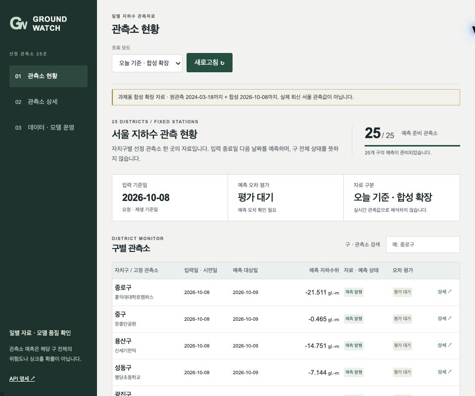
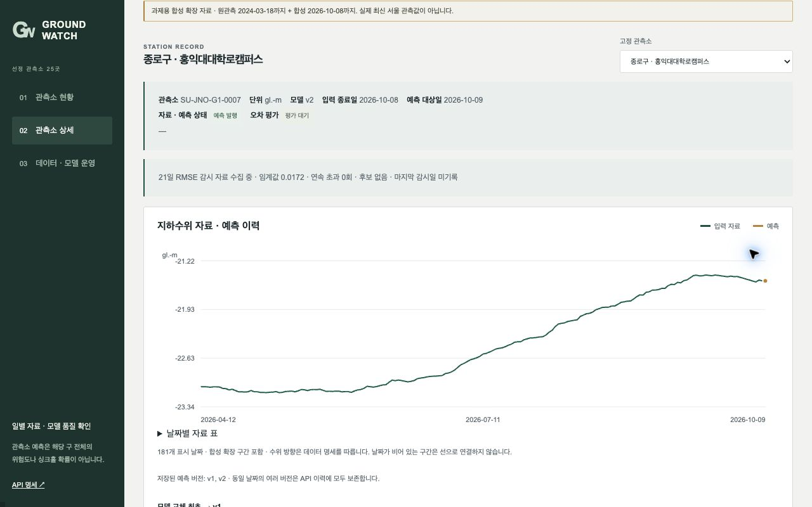
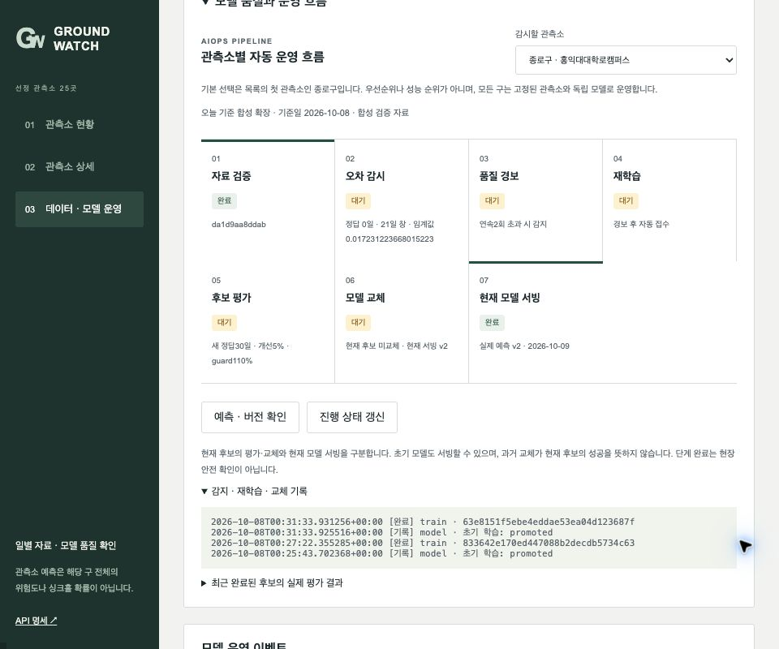
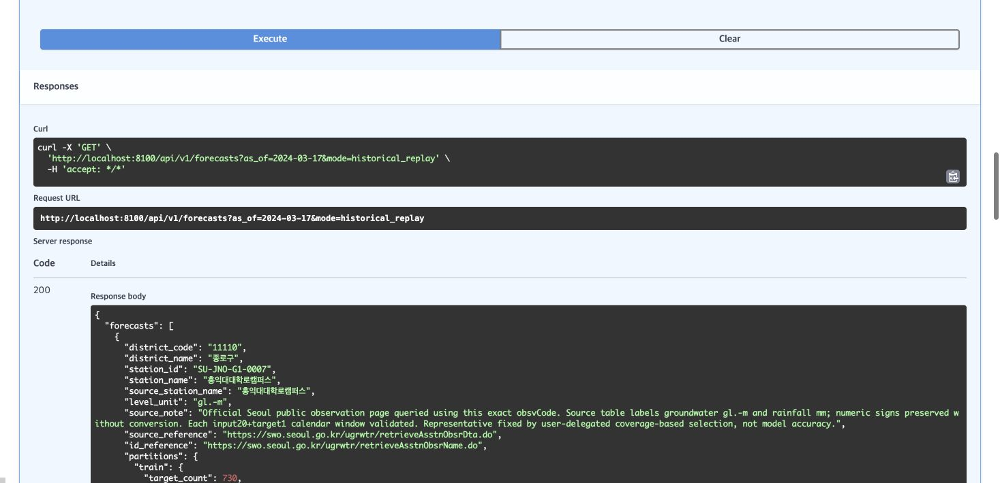
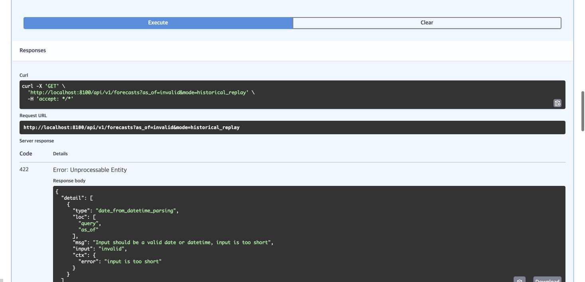
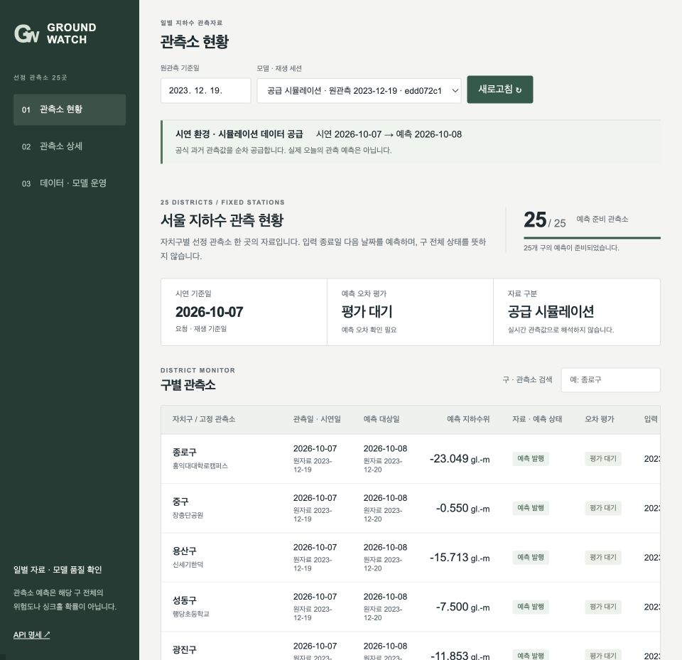
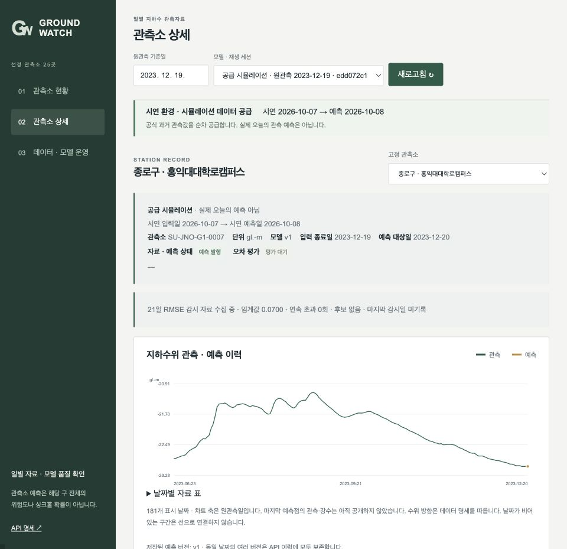
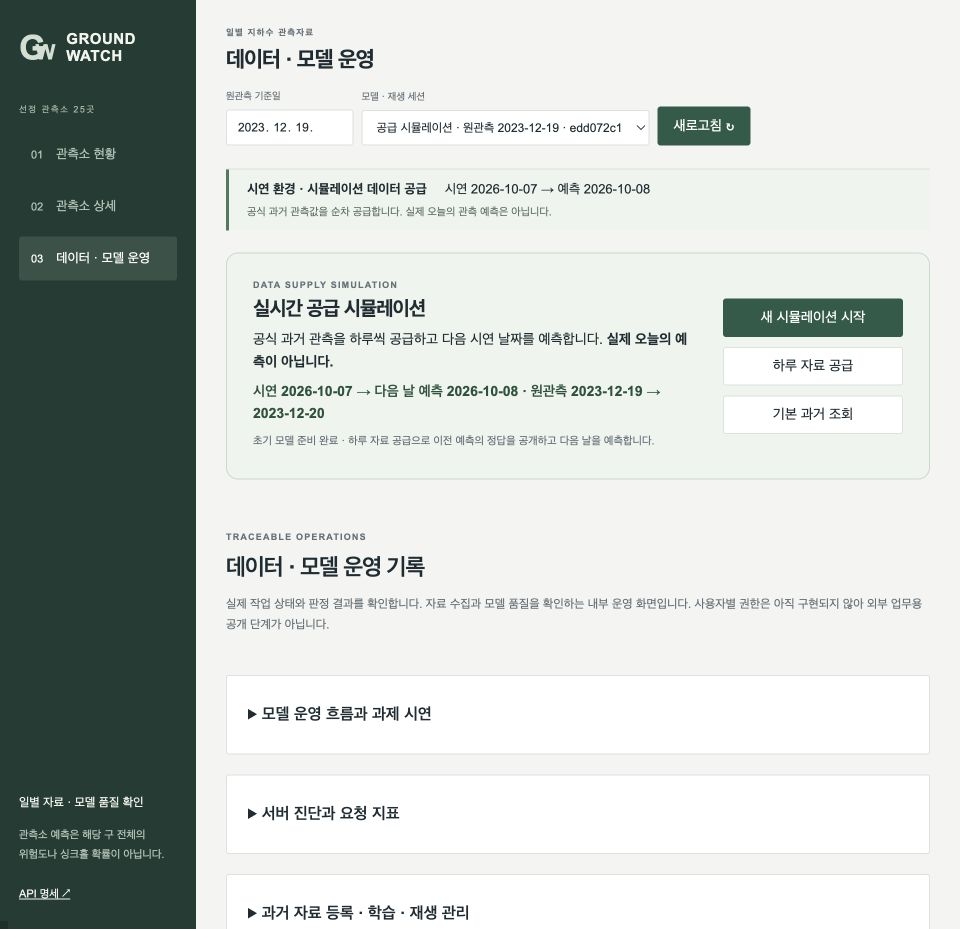

# GroundWatch 팀 기획 및 구현

2026-10-08 최종 범위 반영판입니다. 교수자 시뮬레이션 자료 허용을 바탕으로, 공식 과거 관측 52,591행은 그대로 보존하고 2024-03-19~서울 오늘의 합성 수위·강수량을 별도 자료에 추가합니다. 2026-10-08 기준 23,350행을 생성하여 총 75,941행으로 별도 모델 25개를 학습했습니다. 기본 화면은 실제 달력의 오늘 입력→내일 예측이며 작은 합성 자료 표시를 유지합니다. 최신 서울 API 실측을 확보한 것으로 설명하지 않습니다. 과거 실측 모델·평가와 합성 모델·평가를 분리하며 기존 AIOps 재생·감시·재학습·후보 평가 기능은 보존합니다.

## 1. 이해관계자와 Pain Point

현재 기획의 주 사용자는 공공기관의 지하수·지하안전 업무 담당자이며 직접 판매하면 B2G입니다. 민간 환경안전 용역사가 구매하는 B2B 경로는 별도로 검증할 수 있습니다. 기존 팀 지침의 B2B 조건과 현재 공공기관 구매자 지향의 과제 적합성은 교수자 확인 전 확정하지 않습니다. 기관 구매 의사나 현장 효용을 검증한 단계는 아닙니다.

관측 자료를 따로 확인하면 변화가 있는 지역을 늦게 검토할 수 있고, 예측 모델의 오차가 커져도 기존 값을 계속 참고할 수 있습니다. 서비스 장애·자료 지연은 검토를 중단시키며, 모델 품질 저하는 예측값의 신뢰성을 낮출 수 있습니다. 공개 관측소 하나가 공사 현장이나 구 전체를 대표한다고 단정하지 않습니다. 실제 피해 예방과 점검 시간 절감은 아직 측정하지 않은 가설입니다.

## 2. AI 해결책과 운영 목표

서울 25개 구마다 공식 관측소를 하나씩 고정하고 최근 연속20일의 수위·강수로 입력 종료일 다음 날 수위를 예측합니다. 기본 화면은 오늘까지 준비한 합성 확장 자료로 내일을 예측합니다. 과거 관측 검증은 확보한 과거 자료의 날짜 안에서 진행합니다. 자료나 모델이 미준비이면 예측값 대신 사유를 표시합니다. 미래 강수는 입력하지 않습니다. 관측소·기준일·단위·실제 모델 버전을 함께 보여줍니다. 현재 과거 자료의 수위는 공식 표기 `gl.-m`, 강수는 `mm`이며 자료 출처와 고정 목록은 [데이터 설명](data/README.md)에 있습니다.

지하수위 변화가 작은 특성을 반영해 마지막 관측값에 LSTM이 학습한 변화량을 더하는 모델을 검증합니다. 단순 persistence 기준과 비교하여 품질을 확인합니다. 운영 목표 초안은 준비된 전체 조회 p95 1초 이하, 통제된 100회 정상 요청 5xx 1% 미만, 잘못된 입력 422, 재시작 후 실제 버전·이력 보존입니다. 실제 측정 조건·달성 여부는 [실행 증거](evidence/README.md)를 따릅니다.

## 3. 운영 설계

공식 과거 자료를 정규 CSV로 보관하고 관측소·단위·매핑을 manifest로 고정합니다. SQLite는 자료 검증·작업·예측·이벤트·모델 교체 이력을 보존하고 MLflow는 학습 결과와 모델 버전을 관리합니다. 날짜 순차 재생에서 그날까지 공개된 관측만 입력합니다.

외부 API 수집은 인증 응답과 실패·제한까지 조사했지만 최신 지하수 자료·단위·매핑을 확보하지 못했습니다. GIMS 신청도 시스템 오류로 접수 미확인입니다. 외부 실측 수집 화면은 제외하고 코드·실패 증거는 보존합니다. 현재 날짜의 과제 시연은 위 합성 확장 자료를 사용합니다. 최신 외부 실측 수집은 보존한 과거 관측 검증 경로를 실행하는 데 필요한 조건이 아닙니다.

공식 ID·단위·유한값·날짜·강수 부호·입력 연속성을 검증합니다. 같은 관측소·날짜의 값 충돌은 격리하고 결측 강수를 0으로 채우지 않습니다. 실제 관측 52,591행에서 과거 유효 학습 정답 최대 730개, 구별 연속 검증·테스트 각 60일, 공통 운영 재생 90일을 분리합니다. scaler는 학습 입력·정답만 사용합니다.

초기 게이트는 검증 RMSE가 persistence RMSE의 110% 이내인 조건입니다. 실패하면 기존 검증 모델을 유지하고, 최초 모델이 없으면 미준비로 표시합니다. 21일 RMSE가 검증 rolling RMSE P95의 1.5배를 두 번 연속 넘으면 운영 이벤트와 재학습 작업을 등록합니다. 알림 수신자는 팀의 운영 담당자이며 MVP는 화면·이벤트 로그로 제공합니다.

최근 연속 41일로 fine-tuning한 후보는 이후 새 정답 30일 동안 기존 모델과 같은 입력으로 비교합니다. 후보 오차 5% 이상 개선, 과거 검증 오차 증가 10% 이내와 로딩 검사를 통과해야 교체합니다. 실패하면 기존 모델을 계속 제공합니다. 모델 품질 회복을 현장 안전 확인으로 해석하지 않습니다. 배수·허용치는 운영 실험 설정이며 현장 안전 기준이 아닙니다. 상세는 [운영 정책](operations.md)을 따릅니다.

### 도메인 치환과 정책 근거

| 과제 요소 | GroundWatch 적용 |
| --- | --- |
| 예측 대상 | HAIC 가격 대신 구별 고정 관측소 다음 날 지하수위 |
| 입력 | 과거 연속20일 수위·일 강수, 미래 강수 제외 |
| 자료 공급 | 공식 과거 관측 + 출처를 구분한 오늘까지 합성 확장; 과거 재생은 날짜별 정답 공개 |
| 평가 게이트 | persistence 대비 초기110%, 후보5% 개선·과거guard110% |
| 예측 오차 증가 | 21일 RMSE와 validation rolling P95×1.5 비교 |
| 재학습 | 연속41일 fine-tuning, 이후30개 새 정답 평가 |
| 알림 | 화면·영속 이벤트, 운영 담당자의 확인·조치 기록 |
| 이해관계자 | 공공기관 지하수 업무 담당자·구매 의사결정자 (직접 판매 B2G) |

초기110%는 단순 기준보다 크게 나빠진 모델을 차단하는 허용 범위이며 우수 모델 보장은 아닙니다. 21일 창은 일별 잡음을 완화하고, 연속2회 초과와21일 cooldown은 반복 작업을 줄이려는 설정입니다. 후보5% 개선은 작은 지표 변동만으로 교체하는 것을 줄이고, 과거guard110%는 새 구간 적응으로 이전 품질이 크게 나빠지는 것을 막습니다. 후속30일은 학습에 없던 정답을 기다리는 평가 기간입니다. 모든 값은 과제 운영 가설이며 재난·안전 기준으로 검증되지 않았습니다.

저장된90일 예측으로 배수1.25/1.5/2.0와 연속1/2/3회를 비교했습니다. 연속2회·cooldown21일에서 정상 관측의 잠재 알림은27/15/8건, 모의 변화는33/23/15건이었습니다. [분석 원문](evidence/reaudit-policy-sensitivity.json)은 후보 대기·학습을 다시 실행하지 않은 기술적 비교이므로 실제 알림9/16건과 같지 않으며 오탐률도 아닙니다. 1.5는 민감도와 작업 빈도 사이의 임시 선택입니다. 현장 정답·업무 비용을 확보한 뒤 재조정해야 합니다.

서비스 요청은 최근300초의 p95·5xx·처리량을60초마다 검사하고 최소20건 전에는 판단을 보류합니다. p95>1초 또는5xx≥1%면 운영 담당자가 자료 신선도·worker·모델 로딩·요청 로그를 확인합니다. 오차 알림은 후보 재학습으로 이어지지만 현장 확인 종료는 사람의 별도 기록을 요구합니다.

## 4. 아키텍처와 데이터 흐름

```text
공식 과거 관측 보존 → 별도 오늘까지 합성 확장 → 품질 검증·시간순 분할
                                           ↓
                            LSTM 학습 → 초기 게이트 → MLflow 등록
                                           ↓
브라우저 ← FastAPI 컨테이너 ← 실제 champion 모델의 다음 날 예측·기록
                                           ↓
                   정답 순차 공개 → 21일 오차 감시 → 이벤트·재학습 작업
                                           ↓
                  영속 worker → 후보 학습 → 후속30일 평가 → 교체/기존 유지
```

단일 Docker 서비스 안에서 API와 학습 worker를 별도 프로세스로 실행하고 자료·SQLite·MLflow·모델을 볼륨에 보존합니다. 실제 자료와 모의 변화·합성 성공 검증은 namespace로 격리합니다. 현재는 오늘 기준 합성 자료 예측과 과거 관측 검증을 제공하는 로컬 시제품이며 클라우드·현장 실운영 완료를 주장하지 않습니다.

## 5. API 설계와 실제 확인

아래 성공 예측·평가·화면은 확보한 과거 공식 자료의 검증 결과입니다. 교수자 배치 테스트는 날짜별 입력·정답을 순차 처리하는 재생 작업으로 대응합니다. 외부 공급자 API를 호출하지 않아도 이 내부 서빙 API와 운영 루프는 실행됩니다.

전체 예측은 `GET /api/v1/forecasts?as_of=2024-03-17`, 단일 입력 예측은 `POST /api/v1/districts/{code}/predict`입니다. 응답은 구·관측소·관측일·예측일·수위·단위·실제 버전을 포함하며 미준비는 null과 사유를 반환합니다. 20일이 아닌 입력·날짜 공백·음수 강수·잘못된 날짜는 422, 모델 미준비는 503입니다.

업로드·학습·재생·롤백은 202와 영속 작업 ID를 반환합니다. 동일 자료 재업로드는 기존 검증 결과를 유지하며, 같은 모델의 중복 진행은 409로 처리합니다. Swagger는 `/docs`, 프로세스 상태는 `/health/live`, 모델 준비 수는 `/health/ready`입니다. 전체 필드와 요청 예시는 [공통 계약](docs/contracts.md), 실제 HTTP 결과는 [실행 증거](evidence/README.md)를 따릅니다.

### 실제 API 응답

`GET /api/v1/forecasts?as_of=2024-03-17`은 본문 없이200으로25개 행을 반환했습니다. 단일 입력은 `POST /api/v1/districts/11110/predict`에 연속20일 sequence JSON을 전달합니다. 실제 성공 응답 전체는 다음과 같습니다.

```json
{
  "district_code": "11110",
  "station_id": "SU-JNO-G1-0007",
  "prediction": -23.268960940539838,
  "model_version": "2",
  "unit": "gl.-m",
  "level_unit": "gl.-m",
  "dataset_version": "8a99ad7c8d4da3c9be1fcea8044281fcf538b7fdc29aa376604e9f0334193870",
  "mapping_version": "groundwatch-seoul-v1",
  "observed_date": "2024-03-18",
  "forecast_date": "2024-03-19",
  "namespace": "historical",
  "threshold": 0.06998228291374492
}
```

`GET /api/v1/forecasts?as_of=invalid`은422입니다. 실제 오류 본문과 단일20일 요청 전체는 문서 끝의 API 예시, 원문은 evidence/reaudit-http.json 및 single-predict-request.json에 있습니다. 재생 접수202는 학습 완료와 구분하여 작업 상태를 추가 조회합니다.

## 6. 실행 화면과 시연

화면은 전체 현황·관측소 상세·운영으로 구성합니다. 기본 모드는 오늘 기준 합성 확장 자료이며 2026-10-08 입력→2026-10-09 예측 25/25를 실제 HTTP로 확인했습니다. 기존 과거 자료의 2024-03-18 입력→다음 날 예측 25/25도 보존합니다. 자료 준비·최초 학습은 기동 시 자동으로 수행합니다. CSV 등록·수동 학습은 운영 화면의 접힌 수동 자료 관리에 보존합니다. 등록 자료가 과거까지만 있으면 오늘 예측을 만들지 않고 자료 부족 사유를 표시합니다.

전체 현황은 고정 25개 관측소 예측과 준비 상태, 상세는 수위·강수·예측 이력, 운영 화면은 자료·모델·작업·이벤트·교체 결과를 보여줍니다. 실행은 저장소 루트의 `docker compose up --build` 하나로 시작합니다. 승인된 공식 자료를 처음 검증한 뒤 25개 학습을 작업으로 등록하며 준비 전에도 화면·API는 사용할 수 있습니다.

시연은 실제 자료·버전 확인→정상 재생→명시적으로 표시한 모의 변화→알림·재학습→후속 정답 평가→교체 또는 기존 유지→재시작·롤백 순서입니다. 실제 성공/실패와 화면 캡처는 [실행 증거](evidence/README.md)에 있으며, 아직 실행되지 않은 경로를 성공했다고 발표하지 않습니다. [발표·시연 구성](demo.md)은 20분 이내로 관리합니다.

### 자동 실행 검증

격리된 합성 AR(1) 자료500일과 첫 관측소의 하루0.3 변화 시나리오에서 실제 HTTP 자료 등록→검증→25개 초기 학습→재생90일→21일 오차 경보→영속 worker 재학습→후속30일 평가→champion1→2→최종 HTTP version2를 확인했습니다. 게이트와 학습률을 낮추지 않았습니다. 후보 shadow RMSE0.475578, 기존0.504919로 약5.81% 개선했고 과거guard0.239334는 초기validation0.239003의110% 이내였습니다.

첫 하루0.6 시나리오는 약3.56% 개선에 그쳐 거절됐습니다. 두 실행을 모두 보존합니다. 합성 성공은 서울 실측 개선·현장 일반화 증거가 아닙니다. 실제 서울90일 두 재생에서 후보는 거절 또는 정답 부족 대기였습니다. 원문은 [자동 파이프라인](evidence/reaudit-automatic-pipeline.json), [첫 실패](evidence/reaudit-automatic-attempt1.json)에 있습니다.

### 실제 실행 화면



오늘 입력·내일 예측·원천 단위·실제 모델 버전을 함께 표시합니다. 합성 자료 포함 여부를 표시합니다. 아래 캡처는 문구 간소화 이전에 촬영한 실제 실행 화면입니다.



수위·강수 이력과 품질 감시 임계값을 분리합니다. 원천 강수가 모두0인 구간은 무강수 검증 결과로 과장하지 않습니다.



종로구를 기본 선택으로 두고 다른 24개 구로 바꿀 수 있습니다. 과거 관측 검증 모드의 정상·수위 변화 시나리오는 실제 작업을 등록합니다. 오늘 기준 모드에서는 과거 시계 진행 버튼을 숨깁니다. 자료 검증→오차 감시→품질 경보→재학습→후보 평가→모델 교체와 현재 모델 서빙을 구분해 표시하며 실제 로그를 조회합니다. 작업 접수·실행·실패·후보 평가 결과를 구분합니다. 전체 실행 원문·재시작·롤백 증거는 [검증 기록](evidence/README.md)에 있습니다.

제공 HAIC 스켈레톤, AI가 이번에 구현한 변경, 각 팀원의 기여는 구분합니다. 개인 담당자가 확정되지 않은 기능을 특정 팀원의 직접 구현 성과로 쓰지 않습니다.

### 실행 상태 변화 증빙


운영 화면의 Docker hostname·API PID·worker PID는 /health/runtime에서 실제 조회한 값입니다. Docker Desktop 캡처가 아니며 컨테이너 health·이미지 식별은 evidence/reaudit-container-state.txt에 보존합니다.






합성 검증의 저장 상태를 별도 컨테이너 API로 다시 열어 촬영했습니다. 25개 초기 학습과 첫 후보 승격 후 추가 후보의 정답 대기까지 원본 이력에 보존합니다. 새로 촬영하면서 학습을 다시 실행한 것은 아닙니다.


### 단일 예측의 실제20일 요청

`POST /api/v1/districts/11110/predict`, Content-Type: application/json. 아래 요청과 앞의 성공 응답은 같은 관측일 구간입니다.

```json
{"sequence":[
{"station_id":"SU-JNO-G1-0007","date":"2024-02-28","groundwater_level":-23.3,"rainfall_mm":0.0,"level_unit":"gl.-m"},
{"station_id":"SU-JNO-G1-0007","date":"2024-02-29","groundwater_level":-23.29,"rainfall_mm":0.0,"level_unit":"gl.-m"},
{"station_id":"SU-JNO-G1-0007","date":"2024-03-01","groundwater_level":-23.28,"rainfall_mm":0.0,"level_unit":"gl.-m"},
{"station_id":"SU-JNO-G1-0007","date":"2024-03-02","groundwater_level":-23.27,"rainfall_mm":0.0,"level_unit":"gl.-m"},
{"station_id":"SU-JNO-G1-0007","date":"2024-03-03","groundwater_level":-23.25,"rainfall_mm":0.0,"level_unit":"gl.-m"},
{"station_id":"SU-JNO-G1-0007","date":"2024-03-04","groundwater_level":-23.25,"rainfall_mm":0.0,"level_unit":"gl.-m"},
{"station_id":"SU-JNO-G1-0007","date":"2024-03-05","groundwater_level":-23.24,"rainfall_mm":0.0,"level_unit":"gl.-m"},
{"station_id":"SU-JNO-G1-0007","date":"2024-03-06","groundwater_level":-23.23,"rainfall_mm":0.0,"level_unit":"gl.-m"},
{"station_id":"SU-JNO-G1-0007","date":"2024-03-07","groundwater_level":-23.24,"rainfall_mm":0.0,"level_unit":"gl.-m"},
{"station_id":"SU-JNO-G1-0007","date":"2024-03-08","groundwater_level":-23.24,"rainfall_mm":0.0,"level_unit":"gl.-m"},
{"station_id":"SU-JNO-G1-0007","date":"2024-03-09","groundwater_level":-23.24,"rainfall_mm":0.0,"level_unit":"gl.-m"},
{"station_id":"SU-JNO-G1-0007","date":"2024-03-10","groundwater_level":-23.24,"rainfall_mm":0.0,"level_unit":"gl.-m"},
{"station_id":"SU-JNO-G1-0007","date":"2024-03-11","groundwater_level":-23.24,"rainfall_mm":0.0,"level_unit":"gl.-m"},
{"station_id":"SU-JNO-G1-0007","date":"2024-03-12","groundwater_level":-23.24,"rainfall_mm":0.0,"level_unit":"gl.-m"},
{"station_id":"SU-JNO-G1-0007","date":"2024-03-13","groundwater_level":-23.25,"rainfall_mm":0.0,"level_unit":"gl.-m"},
{"station_id":"SU-JNO-G1-0007","date":"2024-03-14","groundwater_level":-23.25,"rainfall_mm":0.0,"level_unit":"gl.-m"},
{"station_id":"SU-JNO-G1-0007","date":"2024-03-15","groundwater_level":-23.26,"rainfall_mm":0.0,"level_unit":"gl.-m"},
{"station_id":"SU-JNO-G1-0007","date":"2024-03-16","groundwater_level":-23.26,"rainfall_mm":0.0,"level_unit":"gl.-m"},
{"station_id":"SU-JNO-G1-0007","date":"2024-03-17","groundwater_level":-23.26,"rainfall_mm":0.0,"level_unit":"gl.-m"},
{"station_id":"SU-JNO-G1-0007","date":"2024-03-18","groundwater_level":-23.27,"rainfall_mm":0.0,"level_unit":"gl.-m"}
]}
```

### 잘못된 날짜의 실제 오류

```json
{"detail": [{
  "type": "date_from_datetime_parsing",
  "loc": ["query", "as_of"],
  "msg": "Input should be a valid date or datetime, input is too short",
  "input": "invalid",
  "ctx": {"error": "input is too short"}
}]}
```

### 업로드·재생·작업·로그 예시

아래는 저장된 합성 자동 검증의 실제 응답에서 관련 필드를 발췌한 예시입니다. 지금 새 학습을 실행한 결과가 아닙니다. 전체 응답은 evidence/reaudit-automatic-pipeline.json에 있습니다.

POST /api/v1/datasets, multipart file=synthetic.csv·manifest=manifest.json →202

```json
{
  "dataset_id": "2d89f57e960f3b79a67edacb4c1cb3cae5bccb93154ae02393e39c054f65d578",
  "job_id": "12a96761332840e6a537b6fc1b4d6e93",
  "status": "validating"
}
```

POST /api/v1/replays, JSON {dataset_id, start_date:"2021-02-13", end_date:"2021-05-14", scenario:"historical"} →202

```json
{
  "id": "85848dec46fc4abca77f22457becc953",
  "job_id": "133a07fd3f5c4cba88d40f84966e1ae7",
  "status": "initializing",
  "as_of": "2021-02-13"
}
```

POST /api/v1/replays/{id}/advance, JSON {"days":90} →202로 작업을 접수합니다. 아래 본문은 접수 응답이 아니라 이후 GET /api/v1/jobs/{id} →200으로 조회한 완료 상태입니다.

```json
{
  "id": "b63bbddf452e4f99b13264467268f37e",
  "kind": "advance",
  "status": "completed"
}
```

GET /api/v1/jobs/{id}, 본문 없음 →200

```json
{
  "id": "133a07fd3f5c4cba88d40f84966e1ae7",
  "kind": "train",
  "status": "completed"
}
```

GET /api/v1/events, 본문 없음 →200, {events:[...]}에 감지·재학습·평가·교체 이력을 반환합니다. 원문 events 필드는 위 증빙에서 확인합니다. GET /health/live →200, {"status":"alive","service":"GroundWatch"}를 이번 검수에서도 확인했습니다. GET /health/ready는 모델 준비 부족 시503입니다. 업로드 필수 파일 누락422, 존재하지 않는 작업404, 중복 진행409이며202는 완료를 뜻하지 않습니다.

### 이전 공급 재생 도구와 교수자 허용 근거

2026-10-07 사용자께서 교수님이 시뮬레이션 데이터를 만들어 진행해도 된다고 허용하셨음을 전달했습니다. 이전 공급 재생 도구는 공식 과거 관측값의 공급 시점과 시연 달력만 재현합니다. 기본 화면은 2026-10-08 변경에 따라 별도 합성 확장 자료를 사용합니다. 데이터를 임의 생성한 실험과 구분합니다. 예측·오차 감시·재학습·후보 평가·교체 또는 기존 유지는 실제 코드와 모델로 실행됩니다. 실제 납품·현장 성능 검증 완료를 뜻하지 않습니다.

최신 실제 관측자료를 확보하지 못한 부분만 공급 시뮬레이션으로 대체합니다. 공식 과거 자료·학습·예측·오차 감시·worker·후속 후보 평가는 기존 실제 코드를 사용합니다. 새 UUID 세션은 학습·검증·테스트 이후 구간에서 시작하고, 생성 당시 서울 날짜를 별도 시연 시작일로 저장합니다. 원관측일·예측일·단위·수위 값은 바꾸지 않습니다.

‘하루 자료 공급’은 먼저 저장한 다음 날 예측에 정답을 붙이고 감시한 뒤 시계를 하루 진행합니다. 메인에는 작은 시연 환경 표시와 날짜를 유지하고, 시작·하루 공급 버튼은 운영 화면에 둡니다. 원관측일은 표·상세에서 함께 확인합니다. 다음 날 차트 점의 관측·강수는 정답 공개 전 null입니다. 시뮬레이션의 다일 공급과 미래 관측 기준일 조회는422로 거절합니다. 현재 날짜로 표시했다는 이유로 실제 오늘의 지하수 예측 성능을 주장하지 않습니다. 설계는 docs/supply-simulation-design.md, 실제 HTTP 전후 원문은 evidence/supply-simulation-http.json입니다.





### 데이터 결합·학습 입력 요약

수위와 강수는 같은 서울시 공개 관측 HTML의 날짜 배열 categories1에 대응하는 seriesData1(수위), seriesData4(강수)에서 추출했습니다. 같은 인덱스의 날짜·수위·강수를 묶고 요청한 관측소 ID·구 코드를 붙였습니다. 현재 기상청 ASOS를 join한 자료가 아닙니다. station_id/date로 중복·충돌을 확인하고 고정 manifest에서 관측소·구·단위를 연결합니다. 각 관측소의 연속 20일 [수위, 강수]가 (20, 2) 입력이고 다음 날 수위가 정답입니다. 미래 강수는 입력하지 않습니다.

시간순으로 학습 최대 730개 유효 표본 → 검증 60일 → 테스트 60일 → 공통 재생 90일을 나누고 scaler는 학습에만 적합합니다. 원자료 날짜는 보존합니다. 이전 공급 재생 도구에서는 시연 시계만 별도로 진행하며, 오늘 화면은 실제 날짜의 합성 확장 자료를 사용합니다. 전체 파일 역할·분할 경계·25개 관측소별 확보 행수·단위·결측 처리와 예시는 docs/team-logic-guide.md의 ‘데이터가 모델과 화면까지 연결되는 과정’에 정리했습니다.



### 오늘 기준 합성 확장 자료와 실제 검증

생성식은 과거 같은 달의 강수를 재표본화하고, 수위는 직전 값에서 같은 달 중앙값으로 3% 회귀하면서 표본 편차 1.5%를 더합니다. 관측소별 고정 seed 20261008을 사용합니다. 미래 관측·미래 강수를 입력하지 않습니다. CSV origin 열과 manifest에 실측 종료일·합성 시작일·원본 해시를 기록합니다. 전체 확장 자료는 별도 synthetic namespace로 학습합니다.

학습은 시간순 최대730개 target→검증60일→테스트60일→재생90일, train-only scaler를 유지합니다. 최근 학습 자료 대부분이 합성이므로 평가 결과를 실제 서울 미래 성능으로 해석하지 않습니다. 기존 실제 관측 평가와 섞지 않습니다. 전체25개 LSTM 학습은 약105초 걸렸고25개 모두 기존 초기 게이트를 통과했습니다. 실제 HTTP는 오늘25/25·내일예측·내일정답null·원본25/25보존을 확인했습니다. 근거는 evidence/current-extension-http.json이며 생성 설계는 docs/current-extension-design.md입니다.

## 팀원 및 역할

SKALA 4기 광주3반 5조 · GroundWatch. 팀에서 전달한 역할이며, 개인별 직접 구현 성과와 구분합니다. 발표·제출용 DOCX/PDF 맨 마지막 페이지에 각 팀원의 사진 자리를 마련했습니다.

| 이름 | 역할 | 사진 |
| --- | --- | --- |
| 조건우 | PM | 사진 추가 예정 |
| 박건우 | 프론트엔드·백엔드 개발 | 사진 추가 예정 |
| 이병주 | 프론트엔드·백엔드 개발 | 사진 추가 예정 |
| 최은주 | AI 모델·AIOps | 사진 추가 예정 |
| 장서연 | AI 모델·AIOps | 사진 추가 예정 |
| 한형준 | 데이터 분석·전처리 및 발표 | 사진 추가 예정 |
